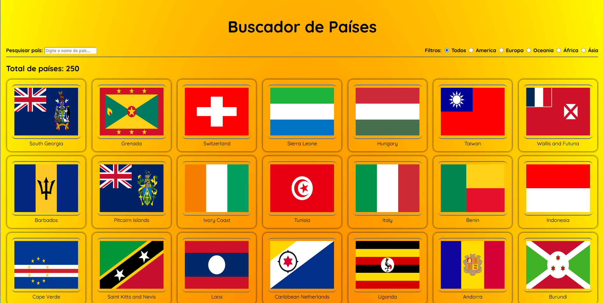
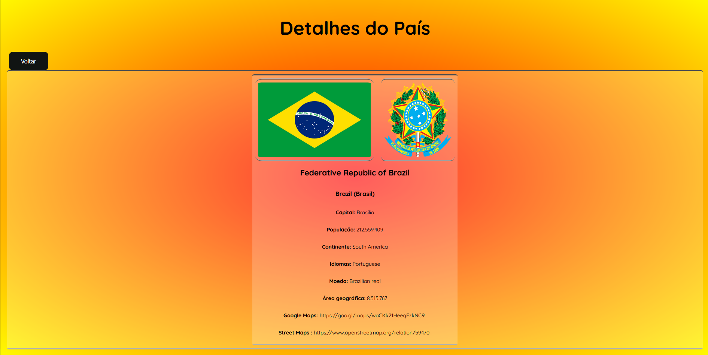

# Projeto Buscador de Países

O projeto consiste em usar uma API pública para a busca de países e mostrar as informações sobre eles como nome oficial, capital, bandeira, moeda entre outras.

## Design do projeto




## API Utilizada

A API utilizada foi a https://restcountries.com/ que fornece os países e informações sobre eles através de um JSON conforme abaixo:

``` 
0	
name	
common	"Brazil"
official	"Federative Republic of Brazil"
nativeName	
por	
official	"República Federativa do Brasil"
common	"Brasil"
tld	
0	".br"
cca2	"BR"
ccn3	"076"
cca3	"BRA"
cioc	"BRA"
independent	true
status	"officially-assigned"
unMember	true
currencies	
BRL	
name	"Brazilian real"
symbol	"R$"
idd	
root	"+5"
suffixes	
0	"5"
capital	
0	"Brasília"
altSpellings	
0	"BR"
1	"Brasil"
2	"Federative Republic of Brazil"
3	"República Federativa do Brasil"
region	"Americas"
subregion	"South America"
languages	
por	"Portuguese"
translations	
ara	
official	"جمهورية البرازيل الاتحادية"
common	"البرازيل"
bre	
official	"Republik Kevreel Brazil"
common	"Brazil"
ces	
official	"Brazilská federativní republika"
common	"Brazílie"
cym	
official	"Gweriniaeth Ffederal Brasil"
common	"Brasil"
deu	
official	"Föderative Republik Brasilien"
common	"Brasilien"
est	
official	"Brasiilia Liitvabariik"
common	"Brasiilia"
fin	
official	"Brasilian liittotasavalta"
common	"Brasilia"
fra	
official	"République fédérative du Brésil"
common	"Brésil"
hrv	
official	"Savezne Republike Brazil"
common	"Brazil"
hun	
official	"Brazil Szövetségi Köztársaság"
common	"Brazília"
ita	
official	"Repubblica federativa del Brasile"
common	"Brasile"
jpn	
official	"ブラジル連邦共和国"
common	"ブラジル"
kor	
official	"브라질 연방 공화국"
common	"브라질"
nld	
official	"Federale Republiek Brazilië"
common	"Brazilië"
per	
official	"جمهوری فدراتیو برزیل"
common	"برزیل"
pol	
official	"Federacyjna Republika Brazylii"
common	"Brazylia"
por	
official	"República Federativa do Brasil"
common	"Brasil"
rus	
official	"Федеративная Республика Бразилия"
common	"Бразилия"
slk	
official	"Brazílska federatívna republika"
common	"Brazília"
spa	
official	"República Federativa del Brasil"
common	"Brasil"
srp	
official	"Савезна Република Бразил"
common	"Бразил"
swe	
official	"Förbundsrepubliken Brasilien"
common	"Brasilien"
tur	
official	"Brezilya Federal Cumhuriyeti"
common	"Brezilya"
urd	
official	"وفاقی جمہوریہ برازیل"
common	"برازیل"
zho	
official	"巴西联邦共和国"
common	"巴西"
latlng	
0	-10.0JS:-10
1	-55.0JS:-55
landlocked	false
borders	
0	"ARG"
1	"BOL"
2	"COL"
3	"GUF"
4	"GUY"
5	"PRY"
6	"PER"
7	"SUR"
8	"URY"
9	"VEN"
area	8515767.0JS:8515767
demonyms	
eng	
f	"Brazilian"
m	"Brazilian"
fra	
f	"Brésilienne"
m	"Brésilien"
flag	"🇧🇷"
maps	
googleMaps	"https://goo.gl/maps/waCKk21HeeqFzkNC9"
openStreetMaps	"https://www.openstreetmap.org/relation/59470"
population	212559409
gini	
2019	53.4
fifa	"BRA"
car	
signs	
0	"BR"
side	"right"
timezones	
0	"UTC-05:00"
1	"UTC-04:00"
2	"UTC-03:00"
3	"UTC-02:00"
continents	
0	"South America"
flags	
png	"https://flagcdn.com/w320/br.png"
svg	"https://flagcdn.com/br.svg"
alt	"The flag of Brazil has a green field with a large yellow rhombus in the center. Within the rhombus is a dark blue globe with twenty-seven small five-pointed white stars depicting a starry sky and a thin white convex horizontal band inscribed with the national motto 'Ordem e Progresso' across its center."
coatOfArms	
png	"https://mainfacts.com/media/images/coats_of_arms/br.png"
svg	"https://mainfacts.com/media/images/coats_of_arms/br.svg"
startOfWeek	"monday"
capitalInfo	
latlng	
0	-15.79
1	-47.88
postalCode	
format	"#####-###"
regex	"^(\\d{8})$"
```

## Funcionalidades

- [x] Filtro de países pelo continente
- [x] Filtro de busca de países
- [x] Pagina secundario de informações sobre o país escolhido
- [x] Informações dos países
    - [x] Bandeira e brasão
    - [x] Nome oficial, comum e traduzido para português do Brasil
    - [x] Capital
    - [x] População
    - [x] Continente
    - [x] Idiomas
    - [x] Moeda
    - [x] Área geográfica
    - [x] Link para o maps
- [x] Responsividade da tela
- [ ] Melhorar o design
- [ ] Rodapé

## Contatos

Email: brunomoreira787@gmail.com
